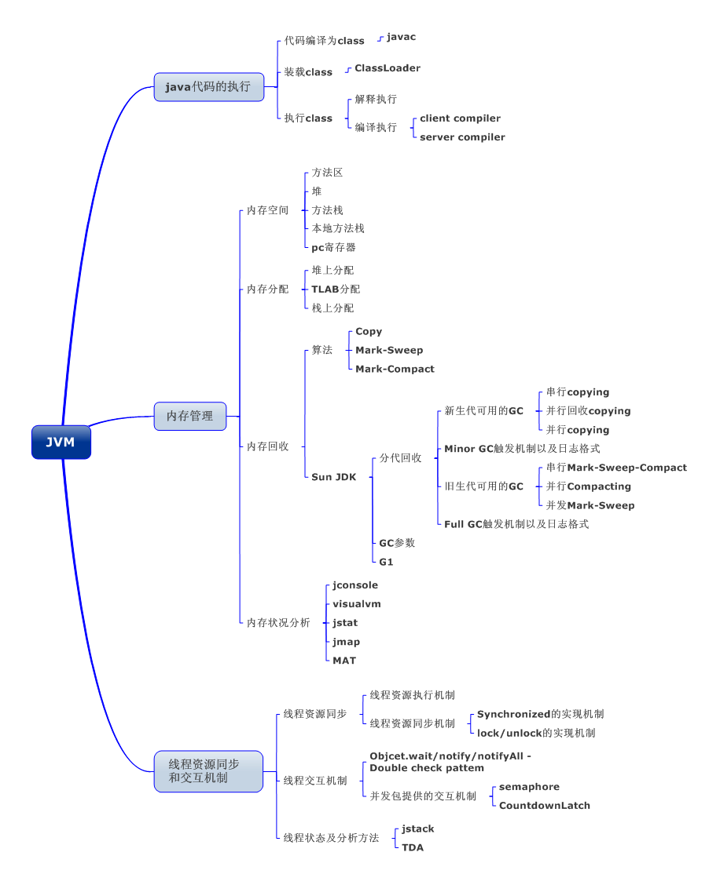

# Java 虚拟机 JVM 概览

Java 虚拟机 JVM 是可运行 Java 代码的假想计算机。包括一套字节码指令集、一组寄存器、一个栈、 一个垃圾回收器、堆和一个存储方法域。JVM 运行于操作系统 OS 之上，与硬件并没有直接交互。

> 图：JVM 知识图谱

我们都知道 Java 源文件通过编译器编译能够生产相应的`.class`文件，也就是字节码文件，而字节码文件又通过 Java 虚拟机中的解释器，编译为特定机器上的机器码执行。关系如下:

- Java 源文件 —> 编译器 -> 字节码文件

- 字节码文件 —> JVM -> 机器码

不同平台的解释器各不相同，但是实现的虚拟机规范是相同的，这也是 Java 能够跨平台的原因。当一个 Java 程序开始运行，JVM 虚拟机实例化，多个程序启动就会存在多个虚拟机实例。程序退出或关闭，虚拟机实例消亡，多个虚拟机实例之间数据不共享。

<!-- [JVM-01-1]: ../../images/JVM-01-1.png -->

<!-- EOF -->
